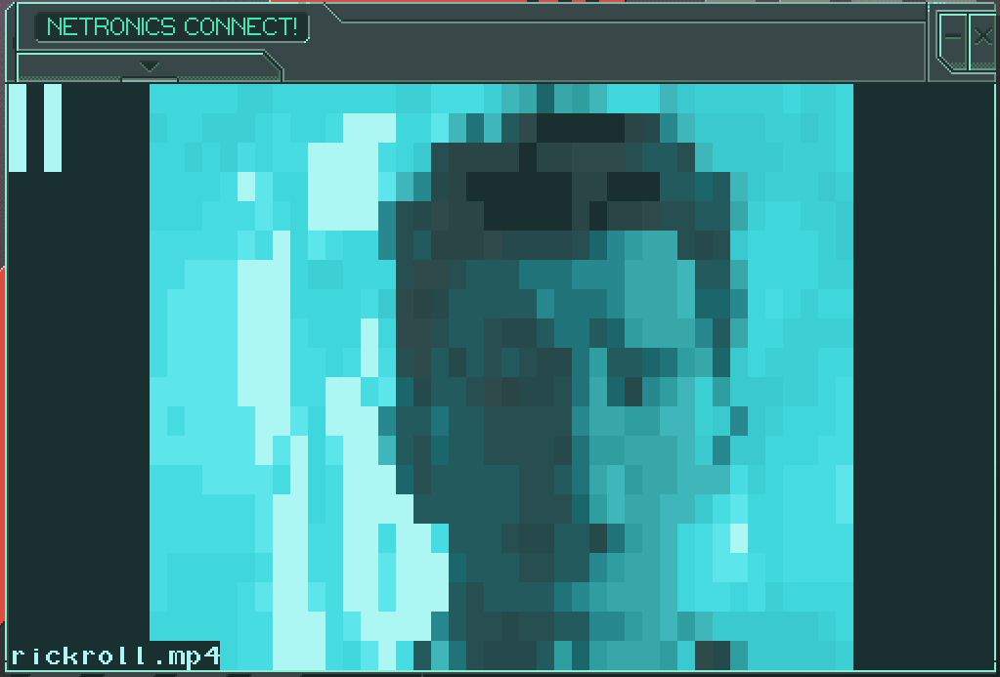

# Last Call BBS Video Player
Video player for the Netronics Connect feature of Last Call BBS!



# Controls
Space - Play/Pause  
Right/J - Advance a frame  
Left/L - Go back a frame  

## Installation
If you just want to see my example, you can copy `rickroll.js` to your `servers` folder and it should appear in the game.

## Generating your own .js files from a video
Each video needs its own .js file which stores all of its pixel data. To make one you need to use the `process_video.py` script.

You can grab a YouTube video as an .mp4 with [youtube-dl](https://youtube-dl.org/). Low quality is perfectly fine since this will greatly reduce quality anyway.

First, install python 3 if you haven't already, then install this project's dependencies:
```
pip -r install requirements.txt
```

Then, you can generate a the .js file with this `process_video.py` script:
```
python3 process_video.py my_movie.mp4 'My Movie' > my_movie.js
```

Then copy `my_movie.js` to your `servers` directory and it should appear in the game.
